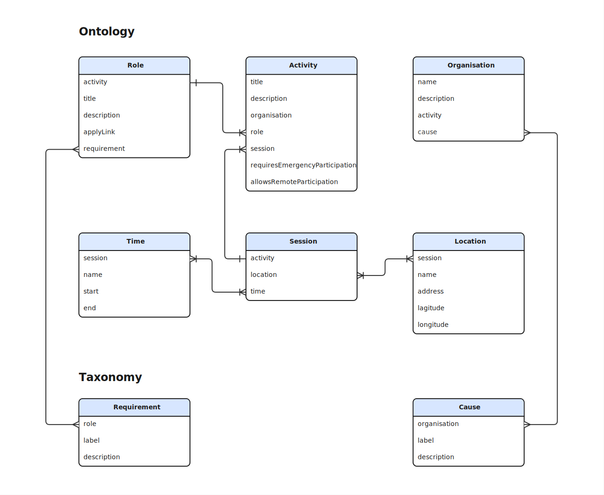

<h2 id="introduction">Introduction</h2>

The volunteering and social action ontology can be <a href="../webvowl/#opts=doc=0;filter_sco=true;mode_compact=true">visualized through WebVOWL</a>, a web-based ontology visualization tool.

The volunteering and social action ontology is implemented using RDF, a native data format for the semantic web. RDF enables the <a href="https://5stardata.info/en/">5-star</a> deployment scheme for Open Data; a scheme suggested by Tim Berners-Lee, the inventor of the Web and <a href="https://www.w3.org/DesignIssues/LinkedData.html">Linked Data</a> initiator.

<h3 id="data-model">Data Model</h3>

The following diagram illustrates the main elements of the Volunteering and Social Action Ontology.

<h2 id="organisation">Organisation</h2>

<h3 id="properties">Properties</h3>

<dl>
  <dt id="org-name">name</dt>
  <dd>The organisation's name.</dd>
  <dt id="org-description">description</dt>
  <dd>A description of the organisation.</dd>
  <dt id="org-website">website</dt>
  <dd>The URL of the organisation's website.</dd>
  <dt id="org-charity-number">charityNumber</dt>
  <dd>The UK charity registration number. See also:
    <a href="https://register-of-charities.charitycommission.gov.uk/">Charity Commission for England and Wales</a>;
    <a href="https://www.oscr.org.uk/about-charities/search-the-register/">Office of the Scottish Charity Regulator (OSCR)</a>;
    <a href="https://www.charitycommissionni.org.uk/charity-search">The Charity Commission for Northern Ireland</a>.
  </dd>
  <dt id="org-activity">activity</dt>
  <dd>An volunteering opportunity offered by the organisation.</dd>
  <dt id="org-cause">cause</dt>
  <dd>A charitable cause the organisation is involved with. See the <a href="./cause">Charitable Cause Taxonomy</a></dd>
</dl>

<h2 id="taxonomies">Taxonomies</h2>

<ul>
  <li><a href="./cause">Charitable Cause Taxonomy</a></li>
  <li><a href="./requirement">Requirement Taxonomy</a></li>
  <li><a href="./skill">Skill Taxonomy</a></li>
</ul>

<h2 id="contributing-knowledge">Contributing Knowledge to the Volunteering and Social Action Ontology</h2>

We welcome domain experts and people with varied experiences of volunteering to contribute their knowledge of the sector. Shared knowledge is the basis to ensure our standard adequately provides structure to address the volunteering sector's needs.

<h3 id="discussion-topics">Discussion Topics</h3>

Please don't hesitate to contribute to the <a href="https://github.com/orgs/volunteeringdata/discussions/">discussions</a> on the volunteering data model repository.

We created 8 categories for focused discussions on specific modeling and requirements topics:

<ul>
  <li><a href="https://github.com/orgs/volunteeringdata/discussions/categories/accessibility">Accessibility</a></li>
  <li><a href="https://github.com/orgs/volunteeringdata/discussions/categories/data-governance">Data Governance</a></li>
  <li><a href="https://github.com/orgs/volunteeringdata/discussions/categories/emergency-response">Emergency Response</a></li>
  <li><a href="https://github.com/orgs/volunteeringdata/discussions/categories/geographical-location">Geographical Location</a></li>
  <li><a href="https://github.com/orgs/volunteeringdata/discussions/categories/roles-and-skills">Roles and Skills</a></li>
  <li><a href="https://github.com/orgs/volunteeringdata/discussions/categories/value-typology">Value Mapping</a></li>
  <li><a href="https://github.com/orgs/volunteeringdata/discussions/categories/volunteer-involving-organisation">Volunteer Involving Organisation</a></li>
  <li><a href="https://github.com/orgs/volunteeringdata/discussions/categories/volunteering-opportunities">Volunteering Opportunities</a></li>
</ul>

<h2 id="standardisation-history">Standardisation History</h2>

The data model's evolution is recorded as a <a href="../working-group/model-version/">series of versions</a>.

